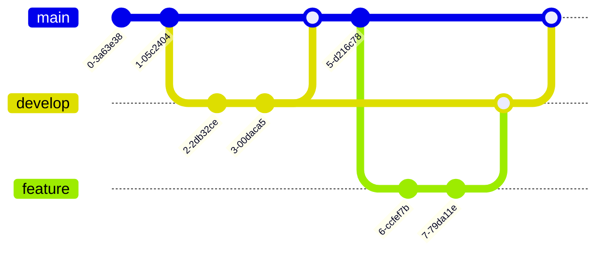

# Mermaid图表测试文档

本文档用于测试Mermaid图表到Word的转换功能。

## 1. 流程图 (Flowchart)

下面是一个简单的流程图示例：

## 2. 序列图 (Sequence Diagram)

用户认证流程序列图：

## 3. 类图 (Class Diagram)

系统核心类结构：

## 4. 状态图 (State Diagram)

订单状态转换图：

## 5. 实体关系图 (ER Diagram)

数据库设计：

## 6. 甘特图 (Gantt Chart)

项目计划时间线：

## 7. 饼图 (Pie Chart)

市场份额分布：

## 8. 用户旅程图 (Journey)

用户购物体验旅程：

## 9. Git图 (Git Graph)

版本控制流程：

## 总结

以上展示了Mermaid支持的主要图表类型：

1. **流程图** - 用于展示流程和决策逻辑
2. **序列图** - 用于展示时序交互
3. **类图** - 用于展示类结构和关系
4. **状态图** - 用于展示状态转换
5. **ER图** - 用于数据库设计
6. **甘特图** - 用于项目计划
7. **饼图** - 用于数据占比展示
8. **旅程图** - 用于用户体验分析
9. **Git图** - 用于版本控制流程

这些图表在转换到Word文档后，应该以图片形式正确显示，并保持良好的可读性。